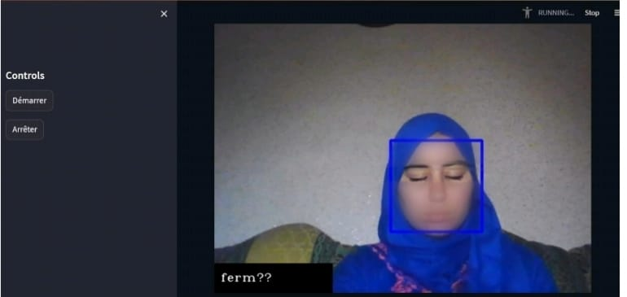
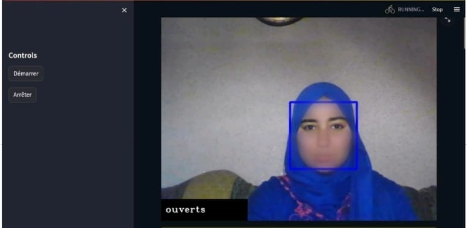
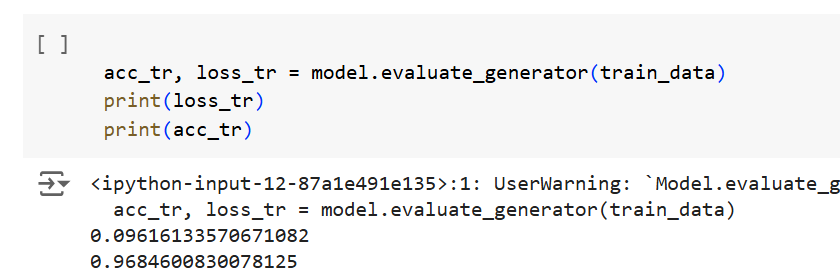
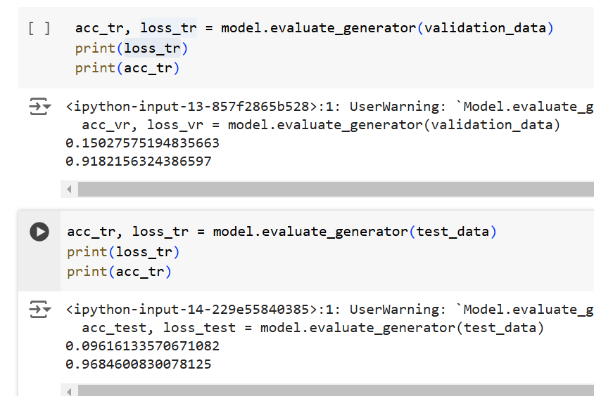
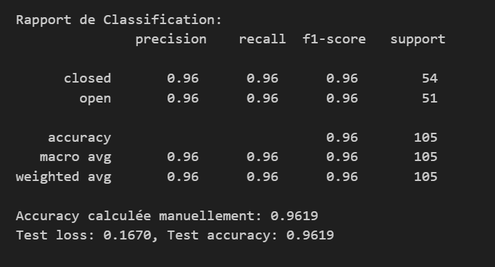

# Real-Time Drowsiness Detection for Drivers

Welcome to the Drowsiness Detection Model project! This project leverages computer vision and machine learning techniques to develop a real-time drowsiness detection application for drivers. Utilizing a Convolutional Neural Network (CNN) model based on the InceptionV3 architecture, the application monitors the movement of the driver’s eyes through a live video stream to identify signs of drowsiness. When fatigue is detected, an audible alarm is triggered to alert the driver.

The Drowsiness Detection Model aims to enhance safety by promptly warning individuals when they exhibit signs of drowsiness, especially in critical situations such as driving or operating heavy machinery.

## Requirements

To run the Drowsiness Detection Model project, you need to have the following software and libraries installed:

1. **Python**: The project is written in Python, so you need to have Python installed on your system. You can download Python from the official website: [python.org](https://www.python.org/).

2. **Dependencies**: The required dependencies for the project are listed in the `requirements.txt` file. You can install them by running the following command:
`pip install -r requirements.txt`

## Usage

1. Clone the repository or download the project files to your local machine.

2. Install the required dependencies mentioned in the "Requirements" section by running the command mentioned above.

3. Open a terminal or command prompt and navigate to the project directory.

4. Run the following command to start the drowsiness detection model using Streamlit:
`streamlit run app.py`

5. The application will open in your default web browser, displaying the user interface for the drowsiness detection model.

6. Follow the instructions provided by the application to use the webcam for video capture and detect drowsiness.

## Harnessing Computer Vision in Real-Time Monitoring

This real-time drowsiness detection project combines computer vision concepts and OpenCV to create an intelligent application capable of monitoring a driver’s alertness state. Here’s how these technologies mix in the project:

**Computer Vision:** The project employs computer vision techniques to analyze the video stream captured by the camera. By focusing on the detection of eyes and faces, we can determine whether the driver is drowsy or alert. Computer vision enables the transformation of raw visual data into actionable insights.

**OpenCV:** OpenCV, or Open Source Computer Vision Library, is the main library used in this project for image processing and object detection. Thanks to its robust features, OpenCV facilitates:

- **Video Capture:** Accessing the camera to obtain a real-time video stream.
- **Face and Eye Detection:** Using cascade classifiers to quickly identify faces and eyes in each frame.
- **Image Processing:** Applying transformations such as grayscale conversion and resizing to prepare images for analysis.
- **Display:** Visualizing the video stream with annotations that indicate the state of the driver’s eyes.

**Deep Learning Integration:** By combining OpenCV with a deep learning model (InceptionV3), the project leverages the strengths of both technologies. OpenCV provides the necessary tools for real-time image processing, while the deep learning model makes predictions about the driver’s eye state. This combination allows for accurate and efficient drowsiness detection.

### Eyes Closed

When the model detects closed eyes, it generates an alert message. Here is an example output:

### Eyes Open

When the model detects open eyes, it does not generate an alert. Here is an example output:

## Dataset

For the development of this project, we used the Drowsiness Dataset provided by Dheeraj Perumandla on Kaggle. This dataset includes images of drivers in various scenarios, making it an excellent choice for training a drowsiness detection model. The main characteristics of the dataset include:

- **Ethnic Diversity**: The images come from different ethnic groups, allowing the model to be more general and effective in real-world situations.

- **Varied Lighting Conditions**: The images were captured under different lighting conditions, providing robustness to the model against environmental variations.

- **Varied Facial Expressions**: The dataset includes various facial expressions, helping the model learn to recognize signs of fatigue amidst other emotions.

- **Varying View Directions**: The images present drivers from different angles, improving the model's ability to detect signs of drowsiness regardless of camera angle.

## Result

total result in a table 

## Contributing
BEN MADANE khadija & EL BARKI Basma
